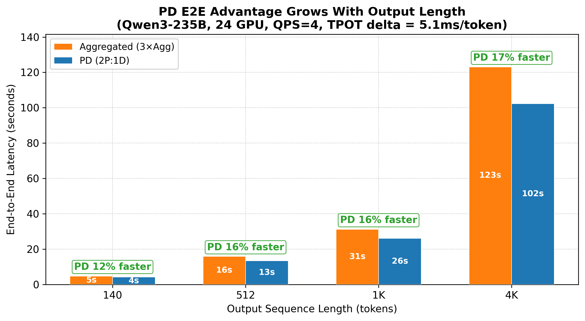

# Achieving Up to 67% Cost Savings with Prefill-Decode Disaggregation Using Ray + vLLM on AMD MI325X


In LLM serving, the optimization objective is deceptively simple: given a set of latency SLA targets -- time to first token (TTFT), time per output token (TPOT), end-to-end latency (E2E) -- maximize the queries per second (QPS) you can sustain. Higher QPS on the same hardware means lower cost per token. Whether your bottleneck is TTFT or TPOT depends on the shape of your workload: the input/output length ratio, KV cache hit rates, and multi-turn conversation patterns all shift the pressure between the prefill and decode phases of inference.

One of the most powerful levers for breaking through the throughput ceiling is **Prefill-Decode (PD) disaggregation**. Instead of running both phases on the same GPUs -- where they compete for compute, memory bandwidth, and scheduling budget -- PD separates them onto dedicated hardware. Prefill nodes handle prompt processing. Decode nodes handle token generation. By eliminating mutual interference, each phase runs closer to its theoretical throughput, and the system as a whole serves more requests under the same SLA constraints.

PD adds operational complexity: KV cache must be transferred across nodes and the prefill-to-decode ratio must be tuned per workload. We show results where under the same GPU budget and SLA, Prefill-Decode disaggregation on Ray + vLLM can serve **1.3x to 2.3x more QPS** than aggregated serving -- depending on the workload (up to **67% compute cost reduction**) and also results where it does not help -- so you can make the right decision for your workload.


*PD vs Aggregated max sustainable QPS under SLA across 5 workload scenarios (same GPU count). Validated on Qwen3-235B and DeepSeek-V3 on AMD MI325X.*

We tested two large MoE models across a range of workloads -- varying input/output lengths, KV cache hit rates, and P:D ratios -- to find where PD saves cost and where it doesn't. This post walks through the core intuition, the AMD-specific stack (RIXL for KV transfer), how to set it up with Ray Serve, and when to use aggregated instead. For a managed solution you can use [Anyscale]() + [Digital ocean]() for bringing similar cost savings to your workloads.

---

## Core Intuition -- Why PD Works (and When It Doesn't)

This section covers the five key insights you need to reason about PD for any workload. Each insight includes data from our experiments, plus clear guidance on when PD loses.

### Insight 1: PD does NOT make prefill faster -- it can actually hurt TTFT

The most common misconception about PD is that it speeds up everything. It does not. On the metric that matters most for interactive responsiveness -- time to first token -- PD is consistently slower than aggregated serving on the same GPU footprint.

**Why aggregated TTFT is already good.** In vLLM's scheduler, there is no separate "prefill phase" or "decode phase." The scheduler runs all currently-active requests -- both prefill and decode -- before admitting new requests from the waiting queue. Chunked prefill is enabled by default for all decoder-only models: long prompts are split into chunks sized by `max_num_batched_tokens` (defaults to 8192). Each chunk runs as one scheduler iteration. Critically, decode steps consume trivially little budget per iteration. A batch of 128 concurrent decode requests uses at most 128 tokens out of the 8192-token budget, leaving the vast majority of each iteration available for prefill tokens. TTFT is therefore dominated by the raw compute time of the prefill forward pass (attention + MoE routing), not by contention with decode.


*In aggregated serving, decode tokens consume only ~1.6% of the scheduler's token budget per iteration — TTFT is dominated by prefill compute, not decode contention.*

**What PD changes.** PD adds a KV cache transfer step after prefill completes. The prefill node sends KV data over the network (RDMA/RoCE) to the decode node. This transfer has inherent overhead that depends on model architecture, KV cache size, and network conditions. Under high load and kv-cache pressure, prefill nodes can also queue up, adding queuing delay on top of transfer overhead.


*In PD serving, the KV cache transfer step between prefill and decode nodes adds overhead that inflates TTFT.*


**The net effect.** On the same GPU footprint, aggregated consistently achieves equal or lower TTFT than PD.


*Figure 3: TTFT vs QPS — Agg TTFT stays flat while PD TTFT rises under load.*

Could you solve the TTFT gap by adding more prefill GPUs? Generally, no. TTFT improves sub-linearly with additional prefill capacity, so the added GPU cost rarely justifies the marginal TTFT improvement compared to what aggregated delivers natively.

#### When this means PD loses -- strictly TTFT-limited SLAs

If your SLA is measured purely on time-to-first-token (e.g., interactive search, auto-complete), aggregated will consistently beat PD. As Figure 3 shows, PD's TTFT baseline on DeepSeek-V3 is ~330ms (due to KV transfer overhead), while Agg stays at ~260ms across all QPS levels:

- Under a **TTFT < 300ms** SLA, PD **cannot serve any traffic** (baseline TTFT exceeds the target), while Agg sustains **7.0+ QPS**.
- Under a **TTFT < 500ms** SLA, Agg sustains **7.0+ QPS** vs PD's **5.0 QPS** -- Agg wins by at least 1.4x.

Agg's advantage here is structural: no KV transfer step, and prefill load is naturally distributed across replicas. If you need *both* fast TTFT and fast TPOT, consider accepting a slightly relaxed TTFT target -- even a small relaxation can unlock major TPOT and E2E improvements through PD.

**Bottom line:** If your SLA is strictly TTFT-limited, aggregated is the simpler and better choice.

---

### Insight 2: PD's real win is flat, stable TPOT under load

This is the core mechanism behind PD's value. In aggregated serving, prefill and decode share the same GPU. Each scheduler iteration that includes prefill tokens is compute-heavier than a pure-decode iteration. As QPS rises, more prefill work stacks up, and decode tokens wait longer. We call this the **"TPOT death spiral"** -- TPOT degrades linearly (or worse) with increasing QPS, because every new prefill request steals compute from all in-flight decode steps.

PD eliminates this entirely. Decode runs on dedicated GPUs that never see a prefill token. TPOT stays nearly flat regardless of how much prefill work is happening on other nodes.


*Figure 4: TPOT vs QPS — Agg TPOT rises steeply ("death spiral") while PD stays flat. Under the target SLA, PD sustains significantly more QPS than Agg on both models.*

---

### Insight 3: TPOT savings compound over output sequence length

PD's per-token TPOT advantage looks modest in isolation (5-10ms). But it multiplies across every output token: 

> **Total savings = TPOT delta × output_length**. 

This compounding is why PD wins on E2E latency despite losing on TTFT.


*A 5.1ms/token TPOT advantage compounds: PD's E2E win grows from 12% at OSL=140 to 17% at OSL=4K (Qwen3-235B, 24 GPU, QPS=4).*

**When PD loses: short output.** For short-output workloads (classification, extraction, short QA), the savings don't accumulate enough to justify the complexity. Use aggregated.

---

### Insight 4: The optimal P:D ratio depends on your workload

This is the most practical insight for practitioners. The P:D ratio determines how GPU resources are split between prefill and decode. Getting it wrong can make PD *worse* than aggregated.

**Key findings across workloads:**

| Workload | Cache Hit Rate | Bottleneck | Optimal Ratio |
|----------|---------------|-----------|--------------|
| Long input, short output (ISL=16K, OSL=1K) | 0% | Prefill throughput | **2P:1D** |
| Long input, long output (ISL=16K, OSL=4K) | 0% | Decode throughput | **1P:3D** |
| Multi-turn with high cache reuse | 80% | Decode throughput | **1P:2D** |
| Multi-turn with moderate cache reuse | 30--60% | Mixed | **1P:1D** to **1P:2D** |

**Rule of thumb:** The marginal GPU should go to wherever the bottleneck is. High cache hit rates make prefill cheap -- allocate more to decode. Low cache hit rates with long inputs -- allocate more to prefill.

#### When this means PD loses -- wrong P:D ratio is worse than aggregated

The most common PD pitfall: deploying with a ratio that does not match the workload. This can make PD strictly worse than aggregated on every metric.


*Wrong P:D ratio can be dramatically worse than aggregated. Always benchmark your specific workload. Start with 1:1, then adjust based on whether TTFT or TPOT hits the SLA first.*

---

## What's Special About AMD -- RIXL and the KV Transfer Stack

PD disaggregation requires high-bandwidth KV cache transfer between prefill and decode nodes. On NVIDIA hardware, this is handled by **NIXL** (NVIDIA Interconnect eXchange Library) over NVLink, InfiniBand, or EFA. On AMD, we use **RIXL** (ROCm Interconnect eXchange Library) -- a plug-and-play replacement for NIXL that uses UCX transport over RDMA/RoCE InfiniBand.

The key point: RIXL exposes the same `NixlConnector` interface in vLLM. Zero code changes are needed in the serving layer. If your vLLM config says `kv_connector: NixlConnector`, it works on both NVIDIA (via NIXL) and AMD (via RIXL). Cross-node transfer bandwidth with RIXL is 10--12 GB/s, comparable to NVIDIA InfiniBand.

### Container and Software Stack

Our container image is built from `Dockerfile.v0.18.dev` with the following components:

| Component | Version / Source |
|-----------|-----------------|
| Base image | `anyscale/ray:nightly-py312-cu128` (or `rayproject/ray:nightly-py312-cu128` for OSS) |
| ROCm | 7.0 (`rocm/dev-ubuntu-22.04:7.0-complete` for build stages) |
| vLLM | 0.18.0 via `wheels.vllm.ai/rocm/0.18.0/rocm700` prebuilt wheels |
| RIXL | Built from source (`ROCm/RIXL` commit `f33a5599`) |
| UCX | Built from source (`ROCm/ucx` commit `da3fac2a`) with `--with-rocm`, `--with-verbs`, `--enable-mt` |
| ROCm Triton | Built from source (`ROCm/triton` commit `f9e5bf54`) |
| Python | 3.12 |

### ROCm Runtime Optimizations

Key environment variables enabled at runtime for optimal AMD performance:

```bash
VLLM_ROCM_USE_AITER=1                        # AMD AI Tensor Engine Runtime
VLLM_ROCM_USE_AITER_MOE=1                    # Optimized MoE kernels
VLLM_ROCM_QUICK_REDUCE_QUANTIZATION=INT4     # Fast all-reduce with INT4 quantization
VLLM_ROCM_QUICK_REDUCE_CAST_BF16_TO_FP16=1  # BF16-to-FP16 cast for quick-reduce
```

### RDMA Transport -- A Critical Operational Note

**Network transport quality is everything.** With proper UCX/RDMA configuration, cross-node KV transfer performs comparably to intra-node. With TCP fallback, throughput degrades catastrophically -- we observed up to **19x degradation** in testing. Always validate your RDMA transport layer before benchmarking PD.

The UCX transport configuration in our deployments:

```bash
UCX_TLS=rc,sm,self,rocm_copy,rocm_ipc
UCX_NET_DEVICES=mlx5_0:1,mlx5_1:1,mlx5_2:1,mlx5_3:1,mlx5_4:1,mlx5_5:1,mlx5_6:1,mlx5_7:1
```

This configures 8x Mellanox ConnectX interfaces for RoCE fabric, using reliable connected (RC) transport with shared memory and ROCm GPU direct paths. Hardware tested: AMD MI325X with 288GB HBM3e, 8 GPUs per node.

---

## PD in Ray Serve -- It's a Config Change

The entire PD deployment is defined in a single YAML file. Switching between aggregated and PD serving requires changing the config -- not the application code, not the model, not the infrastructure.

### The YAML Config

Here is the actual config used for our Qwen3-235B-A22B experiments (abbreviated for clarity):

```yaml
applications:
  - name: pd-qwen235b
    import_path: pd_app:build_pd_openai_app
    route_prefix: /

    args:
      prefill_config:
        model_loading_config:
          model_id: test-model
          model_source: Qwen/Qwen3-235B-A22B-Instruct-2507
        engine_kwargs:
          tensor_parallel_size: 4
          enable_expert_parallel: true
          enable_prefix_caching: true
          max_model_len: 16384
          gpu_memory_utilization: 0.7
          max_num_batched_tokens: 32768    # Large budget for prompt processing
          kv_cache_dtype: fp8
          quantization: fp8
          enforce_eager: true
          kv_transfer_config:
            kv_connector: NixlConnector    # Same connector for NVIDIA (NIXL) or AMD (RIXL)
            kv_role: kv_both

      decode_config:
        model_loading_config:
          model_id: test-model
          model_source: Qwen/Qwen3-235B-A22B-Instruct-2507
        engine_kwargs:
          tensor_parallel_size: 4
          enable_expert_parallel: true
          enable_prefix_caching: true
          max_model_len: 16384
          gpu_memory_utilization: 0.7
          max_num_batched_tokens: 32768
          kv_cache_dtype: fp8
          quantization: fp8
          compilation_config:
            cudagraph_mode: FULL_DECODE_ONLY  # Decode-only CUDA graph optimization
          kv_transfer_config:
            kv_connector: NixlConnector
            kv_role: kv_both
```

The key design choices in this config:

- **`max_num_batched_tokens: 32768`** on the prefill side gives a large budget to process long prompts efficiently. The decode side can use a smaller budget optimized for pure token generation.
- **`kv_connector: NixlConnector`** with **`kv_role: kv_both`** enables bidirectional KV cache transfer. The connector name is the same regardless of whether NIXL (NVIDIA) or RIXL (AMD) is the underlying transport.
- **`cudagraph_mode: FULL_DECODE_ONLY`** on the decode side enables CUDA/HIP graph capture for decode-only batches, reducing kernel launch overhead.
- **`enable_prefix_caching: true`** on both sides enables KV cache reuse for repeated prefixes, which is critical for multi-turn workloads.

### The App Builder -- One Function Call

The application entry point is a single function:

```python
from pd_app import build_pd_openai_app

app = build_pd_openai_app(dict(prefill_config=..., decode_config=...))
```

This returns a fully wired Ray Serve application with an OpenAI-compatible API. The `build_pd_openai_app` function handles replica creation, ingress routing, and KV transfer coordination. You get `/v1/chat/completions` and `/v1/completions` endpoints out of the box.


*Ray Serve PD topology — Ingress routes to Decode nodes, which forward to Prefill nodes. KV cache transferred via RIXL over RDMA.*

---

## How to Reproduce

Everything needed to reproduce these results is consolidated in a single repository: Dockerfile, serve configs, and benchmark scripts.

### Cluster Requirements

- **Minimum:** 2 nodes x 8 AMD MI325X GPUs (16 GPUs total) for a 1P1D configuration
- **Recommended:** 4 nodes x 8 GPUs (32 GPUs) for exploring different P:D ratios
- **Networking:** RDMA-capable RoCE fabric (8x Mellanox ConnectX interfaces per node). Validate RDMA connectivity before benchmarking -- TCP fallback will invalidate results.
- **Container:** Build from `Dockerfile.v0.18.dev` in the repo, or use the pre-built image: `kouroshhahkha/rocm-vllm-ray:main-nightly-v6`

You can deploy on Kubernetes via KubeRay, or on Anyscale for a managed experience that handles cluster provisioning and image management.

### Deploy

Deploy PD or aggregated with a single command:

```bash
# PD disaggregated
ray serve deploy serve_configs/pd/qwen235b.yaml

# Aggregated baseline
ray serve deploy serve_configs/agg/qwen235b.yaml
```

On Anyscale:

```bash
anyscale service deploy -f serve_configs/pd/qwen235b.yaml
```

### Run Benchmarks

We use the Ray LLM benchmark CLI in interactive mode which is agent friendly and lets you adjust workload parameters and QPS on the fly without restarting:

```bash
python -m ray.llm._internal.serve.benchmark -i
```

In interactive mode:

```
> workload --isl 5400 --osl 140 --hit-rate 0.3 --num-turns 1
> rate 5
> status          # wait for inflight requests to stabilize
> measure 100     # collect 100 request measurements
> save results/pd_5400_140_hr30_qps5.json
```

Typical workflow for a QPS sweep:

1. Set the workload parameters once.
2. Start at low QPS (e.g., `rate 1`), wait for steady state, measure.
3. Increase QPS incrementally (`rate 2`, `rate 3`, ...), measuring at each level.
4. Save results at each QPS point for later comparison.

### Full Reproduction Repository

All artifacts are available at: [Link TBD]

For a quick start, Anyscale + Digital Ocean provides a managed environment where you can skip cluster setup and go directly to deploying the serve config.

---

## Conclusion

PD disaggregation on Ray + vLLM delivers **1.3--2.3x more QPS** under the same GPU budget and SLA -- up to **67% cost reduction** on AMD MI325X. The gains are real, but workload-dependent:

- **PD wins** when your SLA is TPOT- or E2E-sensitive and output is long enough for per-token savings to compound.
- **Aggregated wins** when TTFT is the binding constraint, output is short, or cache hit rates are high enough to eliminate prefill-decode contention.
- **The P:D ratio matters.** Get it wrong and PD is 67% worse than Agg. Get it right and it's 2.3x better.
- **Ray Serve makes it a YAML swap**, not a rewrite. Deploy, benchmark, iterate.

### Get Started

- **Reproduce our results.** Clone the repo [Link TBD], deploy a config, and run the benchmark CLI against your workload.
- **Skip the setup.** [Anyscale]() + [Digital Ocean]() gives you a managed PD environment out of the box.
- **Talk to us.** Found a workload where PD behaves differently? We want to hear about it -- reach out on the [Ray community](https://discuss.ray.io).
