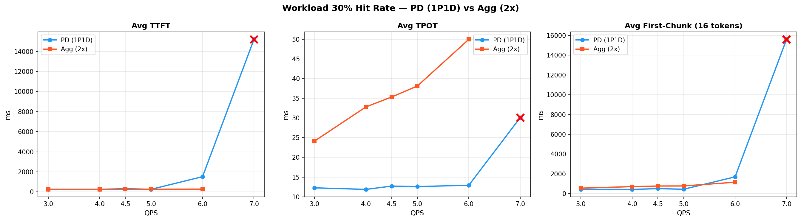
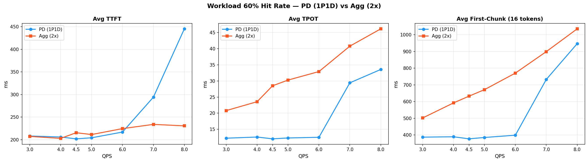
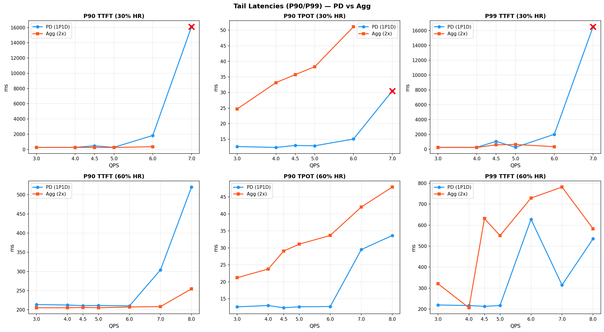
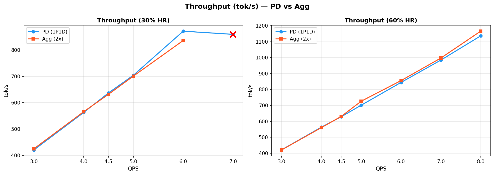
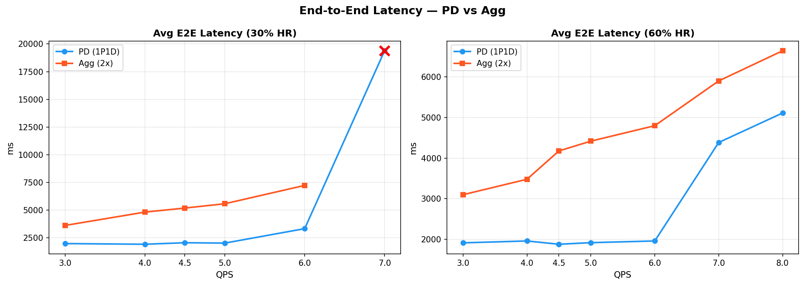
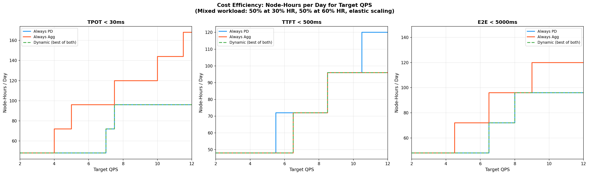
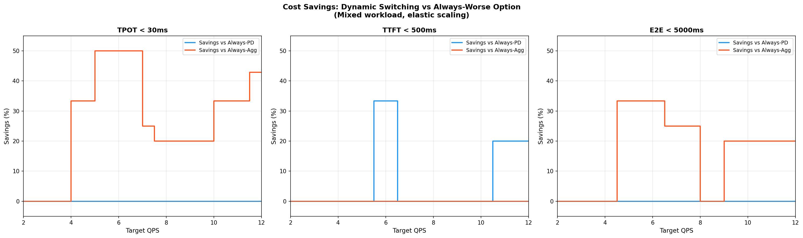

# Agg vs PD at Different Hit Rates — Summary

**Date:** 2026-04-08  
**Model:** DeepSeek-V3-0324 (dummy weights, TP8/EP8, MI325X)  
**Cluster:** 4 worker nodes, 8 GPUs each (32 GPUs total)

## Setup

| Config | Nodes | GPUs | Replicas |
|--------|-------|------|----------|
| PD (1P1D) | 2 | 16 | 1 Prefill + 1 Decode |
| Agg (2x) | 2 | 16 | 2 independent replicas |

**Workloads:**
- ISL=5400, OSL=140, 1 turn
- workload_30p: 30% hit rate (3780 new + 1620 cached tokens)
- workload_60p: 60% hit rate (2160 new + 3240 cached tokens)

**QPS sweep:** 3, 4, 4.5, 5, 6 (+ 7, 8 for 60% hit rate and PD 30% to find saturation)

## Key Findings

### 1. PD delivers dramatically lower TPOT (2-4x better)

The most striking result is PD's TPOT advantage. By isolating decode from prefill interruptions:

| QPS | PD TPOT | Agg TPOT | PD Advantage |
|-----|---------|----------|--------------|
| **30% HR, QPS=3** | 12.3ms | 24.1ms | **2.0x** |
| **30% HR, QPS=5** | 12.6ms | 38.1ms | **3.0x** |
| **30% HR, QPS=6** | 12.9ms | 50.0ms | **3.9x** |
| **60% HR, QPS=3** | 12.2ms | 20.8ms | **1.7x** |
| **60% HR, QPS=5** | 12.3ms | 30.3ms | **2.5x** |
| **60% HR, QPS=6** | 12.5ms | 32.9ms | **2.6x** |

PD's TPOT stays nearly flat (~12ms) across all QPS levels up to 6, while Agg's TPOT degrades linearly with load. This confirms the core hypothesis: **prefill interruptions on shared GPUs directly hurt decode latency**.

### 2. PD has much lower end-to-end latency

Because of the TPOT advantage, PD's end-to-end latency is dramatically lower:

| QPS | PD E2E | Agg E2E | PD Advantage |
|-----|--------|---------|--------------|
| **30% HR, QPS=3** | 1972ms | 3610ms | **1.8x** |
| **30% HR, QPS=5** | 2016ms | 5570ms | **2.8x** |
| **60% HR, QPS=5** | 1916ms | 4419ms | **2.3x** |
| **60% HR, QPS=6** | 1958ms | 4799ms | **2.5x** |

### 3. TTFT is comparable, with different saturation patterns

At low-to-moderate QPS (3-5), TTFT is similar between PD and Agg (~200-270ms). The behavior diverges at high QPS:

- **PD at 30% HR:** TTFT spikes dramatically at QPS=6 (1521ms) and is completely saturated at QPS=7 (15s). This is because the single prefill node becomes the bottleneck.
- **Agg at 30% HR:** TTFT stays relatively low even at QPS=6 (282ms) because prefill load is distributed across 2 replicas.
- **PD at 60% HR:** TTFT stays low much longer (217ms at QPS=6) because more tokens are cached, reducing prefill work.

### 4. Hit rate matters more for PD than Agg

At 30% hit rate (prefill-heavy), PD's single prefill node saturates at QPS~6. At 60% hit rate, PD handles QPS=8 without severe saturation (TTFT=445ms). This confirms: **PD benefits more from higher cache hit rates** because cached tokens reduce load on the prefill node specifically.

For Agg, hit rate also helps (lower TPOT at 60% vs 30%) but the improvement is more modest since prefill and decode share resources anyway.

### 5. First-chunk latency (FC) comparison

PD delivers faster first-chunk at low QPS but Agg is more competitive at higher QPS for 30% HR:

| QPS | PD FC | Agg FC |
|-----|-------|--------|
| **30% HR, QPS=3** | 444ms | 557ms |
| **30% HR, QPS=5** | 449ms | 780ms |
| **30% HR, QPS=6** | 1698ms | 1158ms |
| **60% HR, QPS=5** | 385ms | 671ms |
| **60% HR, QPS=8** | 947ms | 1036ms |

## Conclusions

### When PD wins
- **TPOT-sensitive workloads:** PD provides 2-4x better TPOT. For streaming use cases where per-token latency matters, PD is clearly superior.
- **E2E latency SLAs:** PD's overall request latency is 2-3x lower than Agg at the same QPS.
- **High cache hit rates:** At 60% hit rate, PD handles significantly higher QPS before saturation.

### When Agg may be preferable
- **TTFT-sensitive workloads at high QPS with low hit rate:** At QPS=6 with 30% HR, Agg's TTFT (282ms) is dramatically better than PD's (1521ms). The single prefill node in PD becomes a bottleneck under heavy prefill load.

### Max sustainable QPS (TTFT < 500ms SLA)

| Mode | 30% HR | 60% HR |
|------|--------|--------|
| PD | ~5 QPS | ~7-8 QPS |
| Agg | ~6 QPS | ~8+ QPS |

### Max sustainable QPS (TPOT < 30ms SLA)

| Mode | 30% HR | 60% HR |
|------|--------|--------|
| PD | 6+ QPS | ~7 QPS |
| Agg | ~3-4 QPS | ~4.5 QPS |

**Bottom line:** PD disaggregation provides clear wins for decode-sensitive workloads (streaming, per-token latency). The tradeoff is that TTFT can spike when the single prefill node saturates under heavy prefill load. Scaling to more prefill nodes (2P1D, 2P2D) would likely address this, extending PD's advantage to higher QPS levels.

## Plots

### Workload 30% Hit Rate

### Workload 60% Hit Rate

### Tail Latencies

### Throughput

### End-to-End Latency

---

## Cost Analysis

**Scenario:** 50% of the day at 30% hit rate, 50% at 60% hit rate. Elastic scaling (can adjust node count between periods).

### Max sustainable QPS per 2-node set

| SLA | PD @ 30% HR | Agg @ 30% HR | PD @ 60% HR | Agg @ 60% HR | Best @ 30% | Best @ 60% |
|-----|-------------|--------------|-------------|--------------|------------|------------|
| TPOT < 20ms | 6.4 | 0.0 | 6.4 | 0.0 | **PD** (inf) | **PD** (inf) |
| TPOT < 30ms | 7.0 | 3.7 | 7.1 | 4.9 | **PD** (1.89x) | **PD** (1.45x) |
| TPOT < 40ms | 7.0 | 5.2 | 8.0 | 6.9 | **PD** (1.35x) | **PD** (1.16x) |
| TTFT < 300ms | 4.3 | 6.0 | 7.0 | 8.0 | **Agg** (1.40x) | **Agg** (1.14x) |
| TTFT < 500ms | 5.2 | 6.0 | 8.0 | 8.0 | **Agg** (1.15x) | **Tie** (1.00x) |
| FC < 500ms | 4.4 | 0.0 | 6.3 | 0.0 | **PD** (inf) | **PD** (inf) |
| E2E < 5000ms | 6.1 | 4.3 | 7.8 | 6.2 | **PD** (1.42x) | **PD** (1.26x) |

**Key insight:** PD wins on every SLA that involves decode quality (TPOT, FC, E2E). Agg only wins on TTFT SLAs because its 2 replicas distribute prefill load.

### Cost comparison: node-hours/day (TPOT < 30ms SLA, elastic scaling)

| Target QPS | Always PD | Always Agg | Dynamic | Savings vs worse |
|------------|-----------|------------|---------|------------------|
| 3 | 48 | 48 | 48 | 0% |
| 5 | 48 | 96 | 48 | **50%** |
| 7 | 72 | 96 | 72 | **25%** |
| 10 | 96 | 144 | 96 | **33%** |
| 12 | 96 | 168 | 96 | **43%** |

Under TPOT SLA, **PD is always equal or cheaper than Agg**, because PD can sustain 7 QPS vs Agg's 3.7 QPS per 2-node set (1.9x more efficient). Dynamic switching provides no additional benefit since PD dominates.

### Cost comparison: node-hours/day (TTFT < 500ms SLA, elastic scaling)

| Target QPS | Always PD | Always Agg | Dynamic | Savings vs worse |
|------------|-----------|------------|---------|------------------|
| 5 | 48 | 48 | 48 | 0% |
| 6 | 72 | 48 | 48 | **33%** |
| 8 | 72 | 72 | 72 | 0% |
| 12 | 120 | 96 | 96 | **20%** |

Under TTFT SLA, **Agg is generally equal or cheaper**, because its distributed prefill handles TTFT-sensitive workloads better. Dynamic switching saves up to 33% when PD would need an extra set to handle the 30% HR period.

### When does dynamic switching save money?

Dynamic switching helps when:
1. **The SLA is multi-dimensional** (e.g., TPOT < 30ms AND TTFT < 500ms) — PD wins on TPOT, Agg wins on TTFT
2. **The workload characteristics shift** throughout the day in ways that change which mode is optimal
3. **Target QPS sits at boundary** where one mode needs N sets and the other needs N+1

For a pure TPOT SLA, PD dominates so dynamic switching adds nothing.
For a pure TTFT SLA, Agg dominates so dynamic switching adds nothing.
For a **combined SLA** or when provisioning for peak, dynamic switching can save **20-50%** by using the cheaper option for each period.

### Cost efficiency plot

### Savings from dynamic switching

